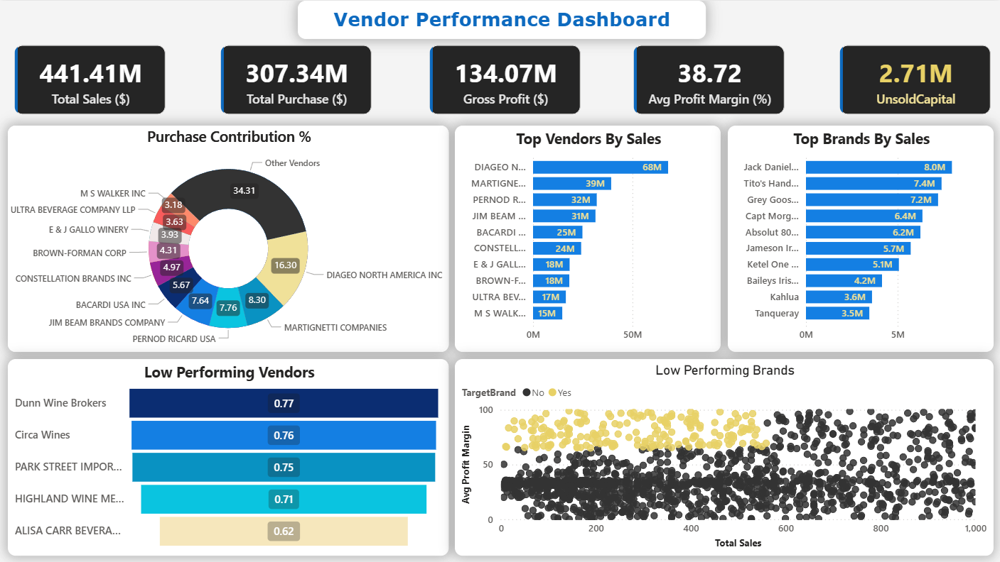

# Vendor Performance Analysis

## 📌 Project Overview
**Goal:** Optimize supply chain and sales strategies by analyzing vendor performance, inventory turnover, and profitability metrics.

In the retail and wholesale industry, effective inventory and sales management are critical for maximizing profitability. This project analyzes internal data to identify inefficiencies such as pricing discrepancies, poor inventory turnover, and over-reliance on specific vendors.

## ❓ Business Problem
The company faces potential revenue losses due to:
* Inefficient pricing strategies.
* High holding costs from slow-moving inventory.
* Supply chain risks due to high vendor dependency.

**Key Objectives:**
1. Identify underperforming brands suitable for promotional adjustments.
2. Determine the top vendors driving sales and gross profit.
3. Assess the impact of bulk purchasing on unit costs.
4. Analyze inventory turnover to reduce holding costs.
5. Investigate profitability variances between high-performing and low-performing vendors.

---

## 🛠️ Data Processing & Methodology
To ensure reliability, the dataset was cleaned and filtered to remove inconsistent transactions:
* **Excluded Losses:** Transactions with `Gross Profit ≤ 0` were removed.
* **Profitability Focus:** Transactions with `Profit Margin ≤ 0` were filtered out.
* **Active Inventory:** Items with `Total Sales Quantity = 0` (unsold inventory) were excluded from the primary performance analysis.

---

## 📊 Key Findings & Insights

### 1. Vendor Dependency Risk
* **Insight:** The supply chain is heavily concentrated. The **Top 10 Vendors contribute 65.69%** of total purchases, while all other vendors combined contribute only 34.31%.
* **Risk:** This over-reliance creates vulnerability to supply chain disruptions.

### 2. Pricing & Promotion Opportunities
* **Insight:** **198 brands** were identified as having low sales volume but high profit margins.
* **Example:** Brands like *Santa Rita Organic Svgn Bl* and *Debauchery Pnt Nr* show margins >65% but very low sales dollars (<$12).
* **Opportunity:** These "hidden gems" are prime candidates for marketing campaigns or strategic price reductions to boost volume without sacrificing overall profitability.

### 3. Bulk Purchasing Efficiency
* **Insight:** Bulk purchasing yields significant cost savings. Large orders secured a **72% lower unit cost** ($10.78/unit) compared to smaller orders ($39.06/unit).

### 4. Inventory Management
* **Insight:** There is **$2.71 Million** tied up in unsold inventory capital.
* **Stock Turnover:** Turnover rates vary wildly (0 to 274.5), indicating some products move instantly while others remain stagnant, increasing storage costs.

### 5. Profitability Paradox (Hypothesis Test)
* **Hypothesis:** Is there a significant difference in profit margins between top-performing and low-performing vendors?
* **Result:** The Null Hypothesis ($H_0$) was **rejected**.
* **Finding:** Surprisingly, **low-performing vendors have higher average profit margins (41.55%)** compared to top vendors (31.17%).
* **Interpretation:** Low-volume vendors likely maintain higher markups but lack the market reach or sales volume of the top vendors.

---

## 🚀 Recommendations
Based on the analysis, the following actions are recommended to stakeholders:

1. **Diversify Supply Chain:** Actively seek partnerships with new vendors to reduce the 65% dependency on the top 10 suppliers.
2. **Revise Pricing for Niche Brands:** Implement targeted discounts or bundle offers for the 198 high-margin/low-sales brands to drive volume.
3. **Leverage Bulk Buying:** Standardize bulk ordering protocols where storage permits to capitalize on the $10.78 vs $39.06 unit cost differential.
4. **Liquidation Strategy:** Address the $2.71M in unsold inventory through clearance sales or adjusting future purchase orders for slow-moving SKUs.

---

## 💻 Tech Stack
* **Python** (Pandas, Matplotlib, Seaborn)
* **Statistical Analysis** (Hypothesis Testing, Confidence Intervals)
* **Data Cleaning & Visualization**
